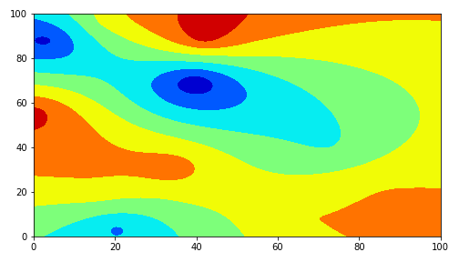
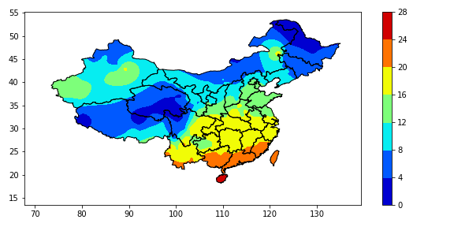

# Ordinary Kriging interpolation
***

Ordinary Kriging interpolation is a linear estimation of regionalized variables. It assumes that the data change into a normal distribution, and considers that the expected value of regionalized variable $Z$is unknown. The interpolation process is similar to the weighted sliding average, and the weight value is determined by spatial data analysis.

ArcGIS has the implementation of this interpolation method, which is rarely used in Python environment, but this project carries out a simple implementation.

# Dependencies
***

- [numpy](https://numpy.org/)
- [shapely](https://www.osgeo.cn/shapely/manual.html)
- [matplotlib](https://matplotlib.org/)

# How to get it
***

`pip install kriging
`